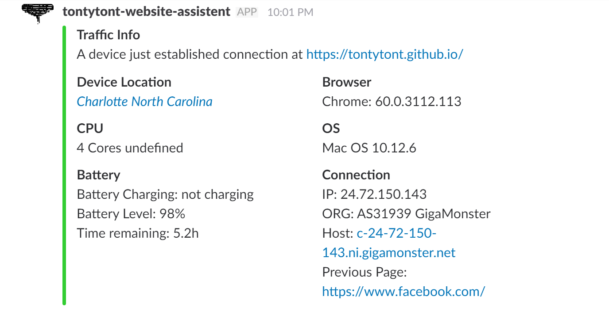
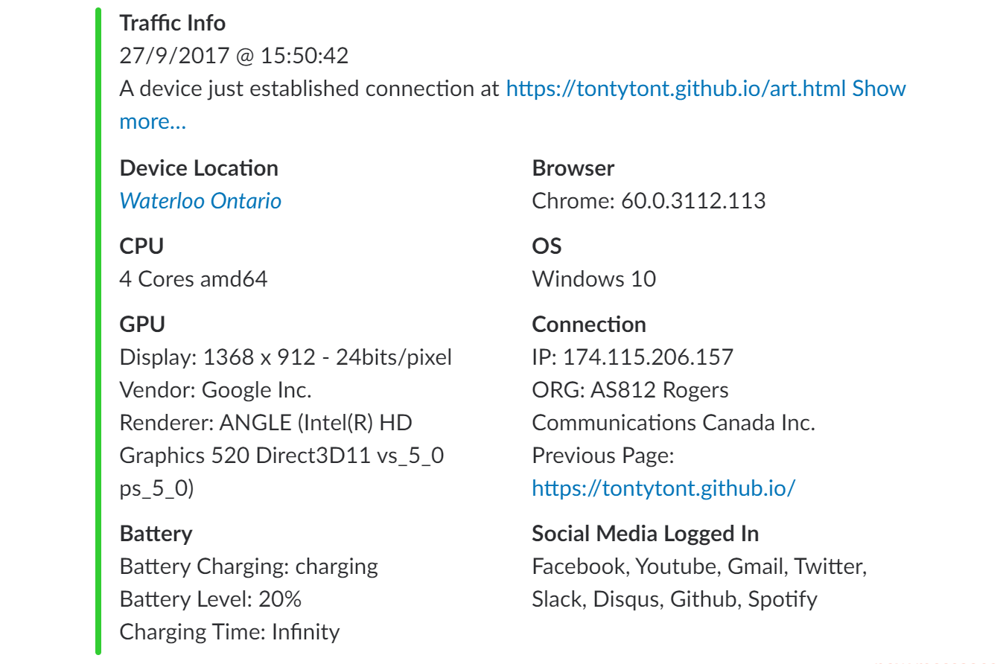

# analytics-slackbot
A web analytics tool integrated with slack webhooks.
Built for the analytical reasons for static/github pages since no server logic can be done on github pages. 

Web Data Includes:
Connection Location, Device Location, Broswer Information, Device CPU, Device OS, Device Battery Information, Connection Information (IP, HOST, Previous Page)

## Set Up
### Step 1
Create a Slack workspace if you don't have one yet. go to [slack.com]
### Step 2
Set up a Sleack Incoming Webhook Integration [https://your-workspace.slack.com/apps/manage/custom-integrations]
Retrieve the Webhook API URL like this one [https://hooks.slack.com/services/somerandomstuffforsecurity]
### Step 3
Put that Webhook API URL into analytics-slackbot.js
And add the js file to your html or server
## And you are done!

### Helpful links:
[https://api.slack.com/incoming-webhooks]
[https://www.google.com/analytics/]